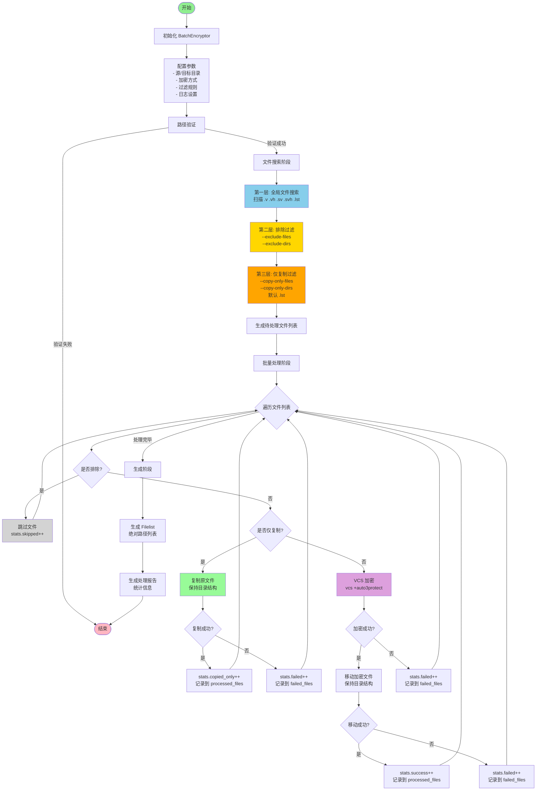
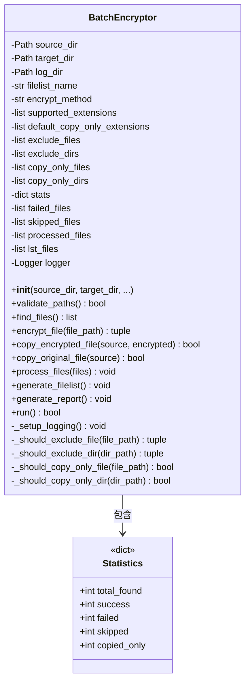
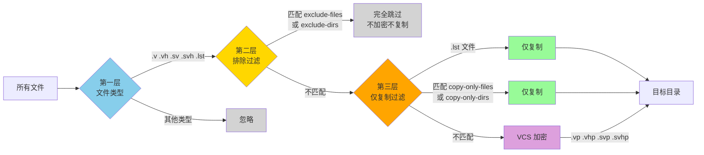
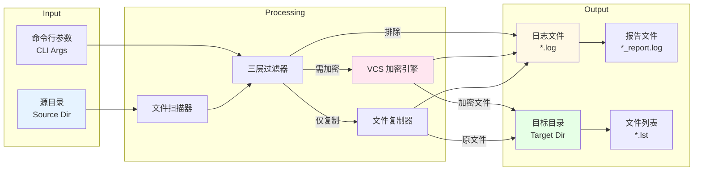

# 批量加密工具使用说明

## 功能概述

`batch_encrypt.py` 是一个用于批量加密 Verilog/SystemVerilog 文件的 Python 工具。它使用 VCS 的加密命令（`+autoprotect`/`+auto1protect`/`+auto2protect`/`+auto3protect`）对文件进行加密，并保持原始项目的目录结构。

## 主要特性

- ✅ 自动检索指定目录下的所有 `.v`, `.vh`, `.sv`, `.svh`, `.lst` 文件
- ✅ 支持多种 VCS 加密方式（`autoprotect`/`auto1protect`/`auto2protect`/`auto3protect`）
- ✅ 保持原始项目目录结构
- ✅ 三层过滤机制：文件类型搜索 → 排除过滤 → 仅复制过滤
- ✅ 支持文件和目录的灵活过滤（排除或仅复制）
- ✅ `.lst` 文件自动识别为文件列表，仅复制不加密
- ✅ 生成文件列表（filelist）包含所有处理文件的绝对路径
- ✅ 自动创建目标目录（如果不存在）
- ✅ 生成详细的日志文件（带时间戳）
- ✅ 生成加密处理报告
- ✅ 支持中断恢复和错误追踪

## 架构设计

### 系统架构图



### 核心类结构



### 三层过滤机制流程



### 数据流图



## 环境要求

### 必需软件
- Python 3.6+
- Synopsys VCS（需在 PATH 中）

### 验证环境
```bash
# 检查 Python 版本
python3 --version

# 检查 VCS 是否可用
which vcs
vcs -help
```

## 使用方法

### 基本用法
```bash
# 最简单的用法（默认使用 auto3protect）
python3 batch_encrypt.py -s ~/work/projA -t ~/work/projA_encrypt

# 指定加密方式
python3 batch_encrypt.py -s ~/work/projA -t ~/work/projA_encrypt \
    --method auto2protect

# 生成文件列表
python3 batch_encrypt.py -s ~/work/projA -t ~/work/projA_encrypt \
    --filelist encrypted_files.lst
```

### 使用排除过滤器
```bash
# 排除测试文件和仿真目录（完全跳过，不加密也不复制）
python3 batch_encrypt.py -s ~/work/projA -t ~/work/projA_encrypt \
    --exclude-files '*_tb.v' 'test_*.sv' \
    --exclude-dirs test simv simulation
```

### 使用仅复制过滤器
```bash
# 某些文件只复制不加密（如头文件、宏定义、SRAM模型）
python3 batch_encrypt.py -s ~/work/projA -t ~/work/projA_encrypt \
    --copy-only-files '*.vh' '*_pkg.sv' 'sram*.v' \
    --copy-only-dirs include defines
```

### 组合使用（推荐）
```bash
# 完整示例：加密方式 + 过滤器 + 文件列表 + 日志目录
python3 batch_encrypt.py -s ~/work/projA -t ~/work/projA_encrypt \
    --method auto3protect \
    --exclude-files '*_tb.v' 'test_*.sv' \
    --exclude-dirs test simulation \
    --copy-only-files '*.vh' 'sram*.v' 'model*.v' \
    --copy-only-dirs include defines \
    --filelist encrypted.lst \
    --log-dir ~/logs
```

### 查看帮助
```bash
# 查看完整帮助和示例
python3 batch_encrypt.py -h
```

## 参数说明

### 必需参数
| 参数 | 说明 | 示例 |
|------|------|------|
| `-s`, `--source` | 源项目目录路径 | `-s ~/work/projA` |
| `-t`, `--target` | 加密文件输出目录 | `-t ~/work/projA_encrypt` |

### 可选参数
| 参数 | 说明 | 示例 |
|------|------|------|
| `-l`, `--log-dir` | 日志目录（默认：当前目录）| `--log-dir ~/logs` |
| `-f`, `--filelist` | 生成文件列表的文件名 | `--filelist encrypted.lst` |
| `-m`, `--method` | VCS 加密方式（默认：auto3protect）| `--method auto2protect` |

**加密方式选项：**
- `autoprotect` - 基础加密
- `auto1protect` - 一级加密
- `auto2protect` - 二级加密（中等强度）
- `auto3protect` - 三级加密（最高强度，默认）

### 排除过滤器（第二层过滤）
| 参数 | 说明 | 示例 |
|------|------|------|
| `--exclude-files` | 排除的文件模式（支持通配符）| `--exclude-files '*_tb.v' 'test_*.sv'` |
| `--exclude-dirs` | 排除的目录模式（支持通配符）| `--exclude-dirs test simv simulation` |

### 仅复制过滤器（第三层过滤）
| 参数 | 说明 | 示例 |
|------|------|------|
| `--copy-only-files` | 仅复制的文件模式（支持通配符）| `--copy-only-files '*.vh' 'sram*.v'` |
| `--copy-only-dirs` | 仅复制的目录模式（支持通配符）| `--copy-only-dirs include defines` |

### 注意事项
- 使用通配符时需要加引号，如 `'*.vh'` 或 `'*_tb.v'`
- `.lst` 文件（文件列表）默认仅复制，无需通过 `--copy-only-files` 指定
- 过滤器按顺序应用：排除过滤 → 仅复制过滤 → 加密处理

## 工作流程

### 三层过滤机制

1. **第一层：全局文件类型搜索**
   - 递归搜索源目录下所有支持的文件类型
   - 支持的扩展名：`.v`, `.vh`, `.sv`, `.svh`, `.lst`
   - 搜索范围：源目录及所有子目录

2. **第二层：排除过滤（完全跳过）**
   - 匹配 `--exclude-files` 模式的文件 → 跳过处理
   - 匹配 `--exclude-dirs` 模式的目录 → 跳过该目录下所有文件
   - 这些文件既不加密也不复制到目标目录

3. **第三层：仅复制过滤（不加密）**
   - `.lst` 文件（文件列表）→ 自动仅复制（默认行为）
   - 匹配 `--copy-only-files` 模式的文件 → 仅复制
   - 匹配 `--copy-only-dirs` 模式的目录 → 该目录下所有文件仅复制
   - 这些文件保持原样复制，不进行加密

4. **加密处理**
   - 通过前三层过滤后的文件 → 执行加密
   - 对 `.v`, `.vh`, `.sv`, `.svh` 文件执行 `vcs +auto3protect`
   - 生成 `.vp`, `.vhp`, `.svp`, `.svhp` 加密文件

### 详细处理步骤

1. **路径验证**
   - 检查源目录是否存在
   - 创建目标目录（如果不存在）
   - 如果目标目录已存在，会提示用户确认

2. **文件检索**
   - 按第一层机制搜索所有支持的文件类型
   - 显示文件统计信息

3. **批量处理**
   - 对每个文件依次应用第二层和第三层过滤
   - 排除的文件：跳过
   - 仅复制的文件：直接复制到目标目录
   - 其他文件：执行加密

4. **结构保持**
   - 将加密文件或原始文件移动到目标目录
   - 保持与源目录相同的文件夹结构

5. **日志生成**
   - 生成详细的处理日志（`batch_encrypt_YYYYMMDD_HHMMSS.log`）
   - 生成处理报告（`encrypt_report_YYYYMMDD_HHMMSS.log`）

## 示例场景

### 场景 1：基本加密（无过滤）
```bash
# 源项目在 ~/work/my_soc
# 加密输出到 ~/work/my_soc_encrypted
# .lst 文件自动仅复制，其他文件使用 auto3protect 加密（默认）

python3 batch_encrypt.py -s ~/work/my_soc -t ~/work/my_soc_encrypted

# 指定加密方式为 auto2protect
python3 batch_encrypt.py -s ~/work/my_soc -t ~/work/my_soc_encrypted \
    --method auto2protect
```

**目录结构示例：**
```
源目录 (~/work/my_soc):
├── rtl/
│   ├── cpu/
│   │   ├── alu.v
│   │   └── decoder.sv
│   ├── filelist.lst     ← 文件列表
│   └── soc/
│       └── top.v
└── tb/
    └── testbench.sv

目标目录 (~/work/my_soc_encrypted):
├── rtl/
│   ├── cpu/
│   │   ├── alu.vp          ← 加密文件
│   │   └── decoder.svp     ← 加密文件
│   ├── filelist.lst        ← 原样复制（不加密）
│   └── soc/
│       └── top.vp          ← 加密文件
└── tb/
    └── testbench.svp       ← 加密文件
```

### 场景 2：排除测试文件和仿真目录
```bash
# 跳过所有 testbench 和 test 目录
python3 batch_encrypt.py -s ~/work/my_soc -t ~/work/my_soc_encrypted \
    --exclude-files '*_tb.v' '*_tb.sv' 'test_*.v' \
    --exclude-dirs test tb simulation simv
```

**处理结果：**
- `*_tb.v`, `*_tb.sv`, `test_*.v` → 完全跳过
- `test/`, `tb/`, `simulation/`, `simv/` 目录 → 完全跳过
- 其他文件 → 正常加密或复制

### 场景 3：头文件和定义文件仅复制
```bash
# 头文件和包文件保持原样，不加密
python3 batch_encrypt.py -s ~/work/my_soc -t ~/work/my_soc_encrypted \
    --copy-only-files '*.vh' '*_pkg.sv' '*_defines.svh' \
    --copy-only-dirs include defines
```

**处理结果：**
- `.lst` 文件 → 自动仅复制（默认）
- `*.vh`, `*_pkg.sv`, `*_defines.svh` → 仅复制
- `include/`, `defines/` 目录下所有文件 → 仅复制
- 其他文件 → 正常加密

### 场景 4：完整生产环境配置
```bash
# 综合使用所有过滤器 + 加密方式 + 文件列表
mkdir -p ~/encryption_logs

python3 batch_encrypt.py \
    -s ~/work/my_soc \
    -t ~/work/my_soc_encrypted \
    --method auto3protect \
    --exclude-files '*_tb.v' '*_tb.sv' 'test_*.v' 'test_*.sv' \
    --exclude-dirs test tb simulation simv workout build \
    --copy-only-files '*.vh' '*_pkg.sv' '*_defines.svh' 'sram*.v' 'model*.v' \
    --copy-only-dirs include defines models \
    --filelist encrypted.lst \
    --log-dir ~/encryption_logs
```

**处理逻辑：**
1. 搜索所有 `.v`, `.vh`, `.sv`, `.svh`, `.lst` 文件
2. 排除测试文件（`*_tb.*`, `test_*.*`）和测试目录（`test/`, `tb/`, 等）
3. `.lst` 文件自动仅复制
4. 头文件（`*.vh`）、包文件（`*_pkg.sv`）、定义文件等仅复制
5. SRAM 模型（`sram*.v`）和其他模型（`model*.v`）仅复制
6. `include/`, `defines/`, `models/` 目录下所有文件仅复制
7. 其余文件使用 `auto3protect` 进行加密处理
8. 生成 `encrypted.lst` 文件列表（包含所有处理文件的绝对路径）
9. 日志保存到 `~/encryption_logs/`

**生成的 filelist 示例：**
```
/home/user/work/my_soc_encrypted/rtl/cpu/alu.vp
/home/user/work/my_soc_encrypted/rtl/cpu/decoder.svp
/home/user/work/my_soc_encrypted/rtl/defines.vh
/home/user/work/my_soc_encrypted/rtl/filelist.lst
/home/user/work/my_soc_encrypted/rtl/soc/top.vp
```

## 日志文件说明

### 日志文件 (`batch_encrypt_YYYYMMDD_HHMMSS.log`)
包含详细的执行过程：
- 过滤器配置信息
- 路径验证信息
- 文件搜索结果（含排除统计）
- 每个文件的处理过程（加密/复制/跳过）
- 错误和警告信息
- 命令执行输出

### 报告文件 (`encrypt_report_YYYYMMDD_HHMMSS.log`)
包含处理汇总：
- 统计信息
  - 总文件数
  - 成功加密数
  - 仅复制数（含默认 `.lst` 文件）
  - 失败数
  - 跳过数（被排除过滤器过滤的文件）
- 失败文件列表及原因
- 源目录和目标目录路径

## 常见问题

### Q1: 提示 "VCS 命令未找到"
**原因：** VCS 未安装或未加入 PATH

**解决方法：**
```bash
# 方法 1: 加载 VCS 环境
source /path/to/vcs/setup.sh

# 方法 2: 添加到 PATH
export PATH=/path/to/vcs/bin:$PATH

# 验证
which vcs
```

### Q2: 加密失败但没有错误信息
**原因：** VCS 可能不支持某些文件类型或文件有语法错误

**解决方法：**
- 查看日志文件中的详细错误信息
- 手动测试单个文件：`vcs +auto3protect -sverilog test.v`
- 检查文件语法是否正确

### Q3: 目标目录已存在
**行为：** 脚本会提示用户确认是否继续

**选项：**
- 输入 `y` 继续（可能覆盖已有文件）
- 输入 `n` 取消操作

### Q4: 如何中断和恢复
**中断：** Ctrl+C 中断执行

**注意：** 已加密的文件会保留，未处理的文件可以重新运行脚本继续

### Q5: `.lst` 文件是否需要手动指定为仅复制？
**回答：** 不需要

**说明：**
- `.lst` 文件（文件列表）会自动识别并仅复制，不进行加密
- 这是脚本的默认行为，无需通过 `--copy-only-files` 指定
- 如果要排除某些 `.lst` 文件，可以使用 `--exclude-files` 排除

### Q6: 如何知道哪些文件被排除、仅复制或加密？
**查看方法：**
- 查看日志文件 `batch_encrypt_YYYYMMDD_HHMMSS.log`
- 每个文件的处理方式都有记录
- 报告文件 `encrypt_report_YYYYMMDD_HHMMSS.log` 包含统计信息

### Q7: 过滤器的优先级是什么？
**优先级顺序：**
1. 排除过滤器（`--exclude-files`, `--exclude-dirs`）→ 最高优先级
2. 仅复制过滤器（`--copy-only-files`, `--copy-only-dirs`, 默认 `.lst`）→ 次优先级
3. 加密处理 → 最低优先级

**示例：**
- 如果文件同时匹配排除和仅复制规则，会被排除（不处理）
- 如果文件只匹配仅复制规则，会被复制（不加密）
- 如果文件不匹配任何过滤器，会被加密

## 性能优化建议

### 大型项目优化
```bash
# 1. 使用排除过滤器跳过不需要处理的文件
python3 batch_encrypt.py -s ~/work/projA -t ~/work/projA_encrypt \
    --exclude-dirs test tb simulation build

# 2. 使用 SSD 存储加快 I/O

# 3. 合理使用仅复制过滤器，避免不必要的加密
python3 batch_encrypt.py -s ~/work/projA -t ~/work/projA_encrypt \
    --copy-only-files '*.vh' 'sram*.v' \
    --copy-only-dirs include models
```

### 批处理多个项目
```bash
# 创建批处理脚本
cat > encrypt_all.sh << 'EOF'
#!/bin/bash
projects=("projA" "projB" "projC")

for proj in "${projects[@]}"; do
    echo "Processing project: $proj"
    python3 batch_encrypt.py \
        -s ~/work/$proj \
        -t ~/work/${proj}_encrypt \
        --exclude-files '*_tb.v' '*_tb.sv' \
        --exclude-dirs test tb simulation \
        --copy-only-files '*.vh' \
        --copy-only-dirs include \
        --log-dir ~/logs
done
EOF

chmod +x encrypt_all.sh
./encrypt_all.sh
```

## 故障排查

### 启用调试模式
修改脚本中的日志级别：
```python
# 在 _setup_logging() 方法中
console_handler.setLevel(logging.DEBUG)  # 改为 DEBUG
```

### 手动测试单个文件
```bash
# 进入源目录
cd ~/work/projA/rtl

# 手动加密（使用 auto3protect）
vcs +auto3protect -sverilog top.v

# 或使用其他加密方式
vcs +auto2protect -sverilog top.v
vcs +auto1protect -sverilog top.v
vcs +autoprotect -sverilog top.v

# 检查输出
ls -l top.vp
```

## 扩展功能

### 自定义默认仅复制文件类型
如果需要添加其他默认仅复制的文件类型（类似 `.lst`）：
```python
# 在 __init__ 方法中修改
self.default_copy_only_extensions = ['.lst', '.f', '.tcl']
```

### 自定义支持的文件扩展名
修改 `supported_extensions` 列表：
```python
# 只处理 .v 和 .sv 文件
self.supported_extensions = ['.v', '.sv']

# 或添加更多文件类型
self.supported_extensions = ['.v', '.vh', '.sv', '.svh', '.lst', '.f']
```

### 添加文件排除规则
通过命令行参数实现（推荐）：
```bash
# 排除特定模式的文件
python3 batch_encrypt.py -s ~/work/projA -t ~/work/projA_encrypt \
    --exclude-files 'third_party_*.v' 'vendor_*.sv' \
    --exclude-dirs third_party vendor
```

## 许可与支持

- **作者：** shig
- **联系：** shig@fvchip.com
- **创建日期：** 2025-12-04

## 更新日志

- **v2.1** (2025-12-05)
  - 添加多种加密方式支持（autoprotect/auto1protect/auto2protect/auto3protect）
  - 添加 filelist 生成功能（绝对路径）
  - 添加跳过/排除文件详细列表输出
  - 新增命令行参数：`-f/--filelist`, `-m/--method`

- **v2.0** (2025-12-04)
  - 添加三层过滤机制
  - 新增 `.lst` 文件支持（文件列表，默认仅复制）
  - 新增排除过滤器（`--exclude-files`, `--exclude-dirs`）
  - 新增仅复制过滤器（`--copy-only-files`, `--copy-only-dirs`）
  - 命令行参数从位置参数改为命名参数（`-s`, `-t`）
  - 所有注释和输出改为英文
  - 改进日志和报告格式

- **v1.0** (2025-12-04)
  - 初始版本
  - 支持 .v, .vh, .sv, .svh 文件加密
  - 保持目录结构
  - 详细日志和报告生成
